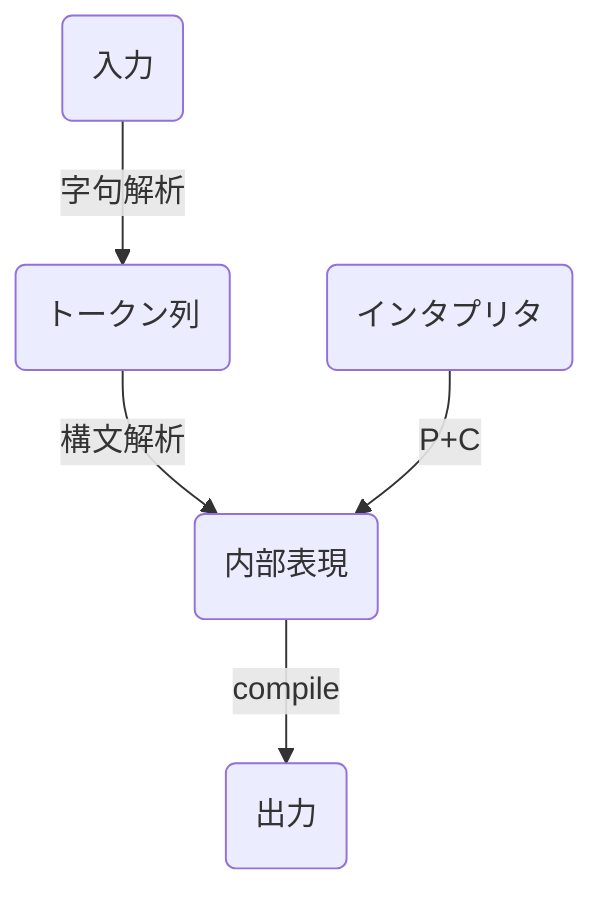

# Parserを作る
Rustで実装を学ぶ

計算機を作る


## 四則演算の処理系

今回は軸解析と構文解析に分けたLLパーサ

### パーサを構成する要素

- 字句解析(lexer)
  文字列からトークンを取り出す
- 構文解析(parser)
  トークンの列から構造を作る

今回はすべて手書きだが多くの場合はライブラリに頼る
crate二もい来るかあり
- nom: マクロベース。高機能だがマクロなのでエラーが分かりにくい
- combine: 関数ベース
などがある


### 処理する計算式

priority|sign|結合性
:--|:--|:--
3|+,-|(単項)
2|*,/|左
1|+,-|左

拡張バッカス・ナウア記法(EBNF)なら

```
EXPR = EXPR3 ;

EXPR3 = EXPR3, ("+" | "-"), EXPR2 | EXPR2 ;
EXPR2 = EXPR2, ("*" | "/"), EXPR1 | EXPR1 ;
EXPR1 = ("+" | "-"), ATOM | ATOM ;
ATOM = UNUMBER | "(", EXPR3, ")" ;
UNUMBER = DIGIT, {DIGIT};
DIGIT = "0" | "1" | "2" | "3" | "4" | "5" | "6" | "7" | "8" | "9" ;
```

### 全体の設計



## 字句解析

### トークン
言語の文法のうち終端記号と呼ばれるものがトークン。文法において直接文字列として表現されている要素。

## 構文解析

字句解析で興味のあるものだけを取り出した後に構造の構築をする

### 抽象構文木の実装

計算の優先度によって構造が変わる。深いところから計算される

トークン取り出し時には`Vec<Token>`だが、parse時にはイテレーターにする
また、LLを使ったパースでは一度だけ先読みが必要なので`Peekable<T>`を使う


## エラー処理

`std::error:Error`を使う
Rust1.33から`description()`を使わず`Display`トレイトを実装するように、`cause()`も非推奨で`source()`を使うようにとされている
自分で作ったエラー型に標準のエラートレイトを実装することで、綺麗にエラー出力ができる

ボイラーテンプレートがいろいろあるのでfailuerクレートなどのエラー処理ライブラリを使うとある程度自動的に生成できる

## 抽象構文木の利用

### 評価機の作成


## ドキュメントを書く


### アイテムにつくもの
`///`がドキュメントコメント
`/** <doc> */`で複数行もかける。行頭に*がある場合はmarkdownと判断する

### 上位アイテムにつくもの
クレート全体の説明など
`//!`か`/*! <doc> */`を使う。基本的には `///`か`//!`が推奨

### ドキュメントの書式

マークダウンの書式。
奇策として以下のセクション名が特定の説明に対して行われる

- Panics: 関数がパニックを起こす可能性がある場合の条件を書く
- Errors: 関数がResultを返す場合にエラーを返す条件を返す
- Safety: unsafeな関数を書くときにユーザーが補償すべき条件を書く
- Example: 関数の使い方の例を書く

### ドキュメント文章の記載

```
//! 
```

### ドキュメントの生成

`cargo doc`で`target/doc/<project_name>/index.html`に生成される


## テスト

### 書き方
#### プログラムに含めない場合

##### 名前空間を分ける
```rs
#[cfg(test)]
mod tests {
  #[test]
  fn testcode() {

  }
}
```

##### テストディレクトリを使う

`<wd>/tests/`の下に適当な名前でファイルを作る


##### ドキュメントに記載する

```rs
...
/// # Example
/// 入力中の単語の頻度を数える例
///
/// ```
/// use std::io::Cursor;
/// use wordcount::{count, CountOption};
///
/// let mut input = Cursor::new("aa bb cc bb");
/// let freq = count(input, CountOption::Word);
///
/// assert_eq!(freq["aa"], 1);
/// ```
pub fn count(input: impl BufRead, option: CountOption) -> HashMap<String, usize> {
  let re = Regex::new(r"\w+").unwrap();
  let mut fregs = HashMap::new();
  ...
```

# Effective tools

- https://godbolt.org/ : アセンブリ出力