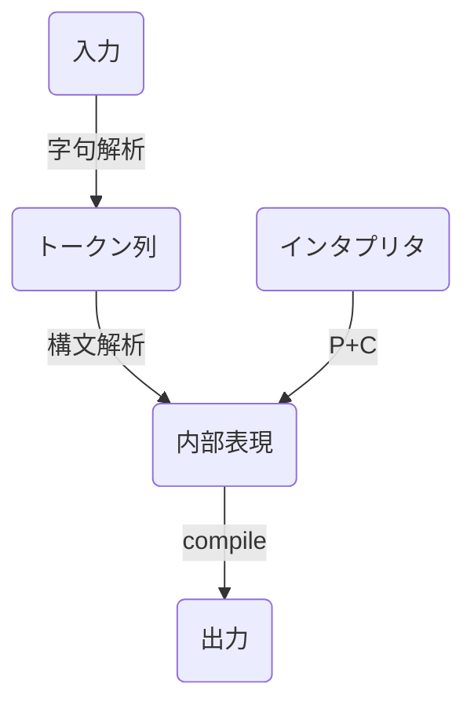

# Parserを作る
Rustで実装を学ぶ

計算機を作る


## 四則演算の処理系

今回は軸解析と構文解析に分けたLLパーサ

### パーサを構成する要素

- 字句解析(lexer)
  文字列からトークンを取り出す
- 構文解析(parser)
  トークンの列から構造を作る

今回はすべて手書きだが多くの場合はライブラリに頼る
crate二もい来るかあり
- nom: マクロベース。高機能だがマクロなのでエラーが分かりにくい
- combine: 関数ベース
などがある


### 処理する計算式

priority|sign|結合性
:--|:--|:--
3|+,-|(単項)
2|*,/|左
1|+,-|左

拡張バッカス・ナウア記法(EBNF)なら

```
EXPR = EXPR3 ;

EXPR3 = EXPR3, ("+" | "-"), EXPR2 | EXPR2 ;
EXPR2 = EXPR2, ("*" | "/"), EXPR1 | EXPR1 ;
EXPR1 = ("+" | "-"), ATOM | ATOM ;
ATOM = UNUMBER | "(", EXPR3, ")" ;
UNUMBER = DIGIT, {DIGIT};
DIGIT = "0" | "1" | "2" | "3" | "4" | "5" | "6" | "7" | "8" | "9" ;
```

### 全体の設計



## 字句解析

### トークン
言語の文法のうち終端記号と呼ばれるものがトークン。文法において直接文字列として表現されている要素。

